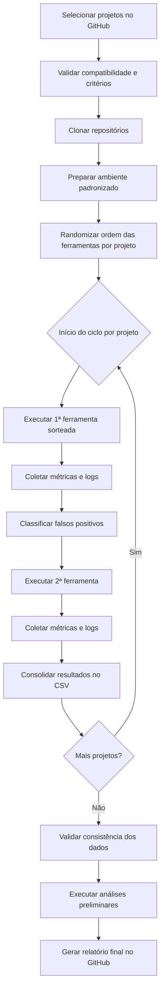

# Plano de Experimento - Scoping e Planejamento
## Identiticação Básica, Contexto e Problema

# 1. Identificação básica 

## 1.1 Título do experimento
Impacto do uso de ferramentas de análise estática na identificação de vulnerabilidades em projetos Node.js open source

## 1.2 Código / Id

``EXP-TCC-2025-ANALISE-ESTATICA-NODE``

## 1.3 Versão do documento

- **Versão Atual:** v1.8

## 1.4 Datas

**Data de criação:** 17/11/2025 | 
**Ultima atualização:** 04/12/2025

## 1.5 Autores

- **Autor:** Gustavo Menezes Barbosa  
 - **Curso / área:** Engenharia de Software  
  - **Instituição:** PUC Minas  
  - **E-mail:** `gustavo.barbosa.1386677@sga.pucminas.br`  

## 1.6 Responsável principal

- **Responsavel principal (PI):** Gustavo Menezes Barbosa

## 1.7 Projeto / Produto

Este experimento está relacionado à proposta de Trabalho de Conclusão de Curso (TCC) na área de **Qualidade de Software e Engenharia de Software Empírica**, com foco em:

- Avaliação do **uso de ferramentas de análise estática** (por exemplo, CodeQL, SonarQube ou ferramentas similares)  
- Aplicadas em **projetos Node.js open source hospedados em repositórios públicos (como GitHub)**  
- Para investigar o impacto dessas ferramentas na **identificação de vulnerabilidades** e **problemas de segurança** em código.

---

# 2. Contexto do problema

## 2.1 Descrição do problema / oportunidade

Apesar do uso crescente dessas ferramentas no mercado, não existem evidencias claras sobre qual realmente encontra vulnerabilidades mais relevantes com menos falsos positivos e menor esforço de triagem.

Projetos de software, especialmente em ambientes colaborativos e open ource, estão cada vez mais expostos a riscos de **vulnerabilidades de segurança** devido a:

- Crescente complexidade das aplicações;
- Uso intensivo de bibliotecas de terceiros;
- Pressão por entregas rápidas.

Ferramentas de **análise estática de código** (como CodeQL, SonarQube e outras) prometem ajudar a **identificar vulnerabilidades e defeitos mais cedo** no ciclo de desenvolvimento, sem necessidade de executar o sistema. No entanto, na prática, ainda existem dúvidas, como por exemplo:

- Em que medida essas ferramentas realmente **encontram vulnerabilidades relevantes** em projetos reais?
- Elas trazem **benefícios mensuráveis** em relação a um cenário sem uso de análise estática?
- Qual é o **tipo de vulnerabilidade** mais frequentemente detectado?
- Há impacto em termos de **quantidade de alertas** gerados e **custo de triagem**?

Diante disso, surge a **oportunidade** de planejar um experimento controlado que:

- Compare projetos com e sem uso de ferramentas de análise estática,  
  **ou**
- Compare diferentes ferramentas entre si,  
para avaliar seu impacto na identificação de vulnerabilidades em projetos Node.js open source.

O problema central pode ser resumido como:

> **Problema:** Não está claro, com base em evidências empíricas, qual é o impacto prático do uso de ferramentas de análise estática na identificação de vulnerabilidades de segurança em projetos Node.js open source, em comparação com um cenário sem essas ferramentas (ou entre diferentes ferramentas).  

Esse problema é relevante tanto para:

- **Desenvolvedores e mantenedores**, que precisam decidir se vale a pena incluir essas ferramentas na rotina de desenvolvimento;
- **Organizações**, que precisam justificar investimentos em ferramentas, infraestrutura e treinamento;
- **Comunidade acadêmica**, que busca dados empíricos para fundamentar recomendações de boas práticas.

### 2.2 Contexto organizacional e técnico

o experimento será planejado considerando o seguinte contexto:

- **Tipo de organização / ambiente:**
  - Contexto acadêmico (disciplina de Laboratório de Experimentação de Software).
  - Possível extensão para projetos reais em organizações que desenvolvem software web.
- **Domínio de aplicação:**
  - Projetos Node.js, com foco em aplicações web e APIs RESTful.
- **Ambiente técnico:**
  - Hospedagem dos repositórios em plataformas como GitHub.
  - Ferramentas de análise estática como:
    - CodeQL (consultas para detecção de vulnerabilidades);
    - SonarQube ou ferramentas similares para análise de qualidade e segurança.
- **Processo de desenvolvimento:**
  - Repositórios com histórico de commits, issues e pull requests;
  - Possível uso de **CI/CD** (GitHub Actions ou outra ferramenta) para automatizar a execução da análise estática.
- **Ferramentas complementares:**
  - Linguagens e tecnologias:
    - Node.js / JavaScript;
  - Scripts e ferramentas para coleta de dados:
    - Scripts em Python ou JavaScript para coletar métricas das ferramentas de análise;
    - Planilhas ou bancos de dados para armazenamento e análise dos resultados.

No cenário futuro do TCC, esse experimento poderá ser:

- Executado usando um conjunto de projetos selecionados a partir de critérios claros (por exemplo número mínimo de estrelas);  
- Integrado ao pipeline de desenvolvimento de uma organização.

## 2.3 Trabalhos e evidências prévias

Algumas evidências e trabalhos prévios que motivam este experimento incluem:

- **Experiências internas (disciplina / laboratório):**
  - Atividades práticas realizadas na disciplina envolvendo ferramentas de análise de código (por exemplo, uso de CodeQL, SonarQube ou ferramentas similares em repositórios de exemplo).
  - Observação empírica de que essas ferramentas geram um número significativo de alertas, mas nem sempre está claro quais são realmente relevantes do ponto de vista de segurança.

- **Evidências externas (literatura e prática de mercado):**
  - Estudos na área de **Engenharia de Software Empírica** que mostram que ferramentas de análise estática podem:
    - Detectar vulnerabilidades de forma antecipada;
    - Apoiar revisões de código;
    - Ajudar a padronizar critérios de qualidade.
  - Relatos de organizações que adotam análise estática em pipelines de CI/CD como parte de uma estratégia de **DevSecOps**.
  - Pesquisas e relatórios de segurança que mencionam:
    - A importância de automatizar a detecção de vulnerabilidades;
    - Limitações, como falsos positivos, curva de aprendizado e esforço de configuração.

Apesar dessas evidências, ainda há **lacunas específicas**, como:

- Falta de dados focados em determinados **ecosistemas tecnológicos** (por exemplo, Node.js);
- Comparações sistemáticas sobre **quantidade e tipo de vulnerabilidades encontradas** com e sem uso dessas ferramentas.

Essas lacunas motivam o planejamento de um experimento mais estruturado, que possa ser evoluído e executado no TCC.

## 2.4 Referencial teórico e empírico essencial

Para fundamentar o experimento, serão considerados pelo menos três eixos principais de referencial:

1. **Qualidade de Software e Manutenibilidade**
   - Conceitos de qualidade interna (código limpo, legibilidade, acoplamento, complexidade, etc.);
   - Relação entre qualidade interna e ocorrência de defeitos e vulnerabilidades.

2. **Engenharia de Software Empírica e Experimentos Controlados**
   - Conceitos básicos de:
     - Experimentos em Engenharia de Software;
     - Hipóteses nula e alternativa;
     - Variáveis independentes (por exemplo, uso de ferramenta X ou Y) e dependentes (por exemplo, número de vulnerabilidades identificadas, tipo de vulnerabilidade, taxa de falsos positivos);
     - Testes de hipóteses para comparar grupos ou tratamentos.
   - Boas práticas de desenho experimental:
     - Definição clara de população e amostra;
     - Procedimentos de coleta e análise de dados;
     - Cuidados com ameaças à validade (interna, externa, de construção e de conclusão).

3. **Segurança de Software e Análise Estática**
   - Conceitos básicos de vulnerabilidades em aplicações web (por exemplo, injeções, XSS, problemas de autenticação/autorização, uso inseguro de dependências);
   - Definição e funcionamento de **análise estática de código**:
     - Detecção de problemas sem executar o programa;
     - Uso de regras, consultas e modelos de fluxo de dados;
   - Estudos anteriores que:
     - Avaliam ferramentas de análise estática;
     - Discutem vantagens (por exemplo, cobertura, automação) e limitações (por exemplo, falsos positivos, dificuldade de configuração).

Esse referencial teórico e empírico servirá de base para:

- Formular a **hipótese nula** e a **hipótese alternativa** do experimento (que serão detalhadas em entregas futuras do trabalho);  
- Escolher as **métricas** a serem coletadas (por exemplo, número de vulnerabilidades encontradas, tipos de alerta, esforço de triagem);  
- Selecionar e justificar o **teste de hipóteses** mais adequado para comparar os resultados dos grupos analisados.

---

# 3. Objetivos e Questões (GQM)

## 3.1 Objetivos Geral 
**Analisar** o impacto do uso de ferramentas de análise estática (CodeQL e SonarQube)  
**com o propósito de** avaliar sua eficácia na identificação de vulnerabilidades  
**sob a perspectiva** de desenvolvedores, equipes de qualidade e gestores  
**no contexto** de projetos Node.js open source hospedados no GitHub.

---

## 3.2

**O1.** Comparar a quantidade e o tipo de vulnerabilidades detectadas entre CodeQL e SonarQube.  
**O2.** Avaliar o custo de triagem (tempo/esforço) dos alertas gerados pelas ferramentas.  
**O3.** Analisar a taxa de falsos positivos produzidos pelas ferramentas.  
**O4.** Avaliar o impacto da análise estática na qualidade geral do código (métricas internas).

## 3.3 Questões de Pesquisa (Por Objetivo)

### **01 - Comparar vulnerabilidades encontradas**

- **Q1.1:** Qual ferramenta encontra mais vulnerabilidades totais?
- **Q1.2:** Qual ferramenta encontra mais vulnerabilidades críticas ou altas?
- **Q1.3:** As ferramentas detectam os mesmos tipos de vulnerabilidades?

--- 

###  **O2 – Custo de triagem**

- **Q2.1:** Quanto tempo é gasto para revisar e classificar os alertas?
- **Q2.2:** Quantos alertas exigem intervenção manual?
- **Q2.3:** A curva de aprendizado da ferramenta impacta o tempo de triagem?

---

### **O3 – Falsos positivos**

- **Q3.1:** Qual ferramenta gera mais falsos positivos?
- **Q3.2:** Quais categorias apresentam mais falsos positivos?
- **Q3.3:** O nível de severidade influencia a taxa de falsos positivos?

---

### **O4 – Impacto na qualidade interna**

- **Q4.1:** Há redução de complexidade ciclomática após uso da ferramenta?
- **Q4.2:** O número de code smells diminui após a análise?
- **Q4.3:** A densidade de defeitos tende a diminuir com a aplicação recorrente das ferramentas?

---

## 3.4 Métricas Associadas

| Objetivo            | Pergunta            | Métrica             | Descrição             |
|---------------------|---------------------|---------------------|-----------------------|
| O1 | Q1.1 | M1 – Nº total de vulnerabilidades | Contagem total de vulnerabilidades detectadas |
| O1 | Q1.2 | M2 – Nº de vulnerabilidades críticas/altas | Quantidade de vulnerabilidades de severidade crítica/alta |
| O1 | Q1.3 | M3 – Diversidade de tipos detectados | Número de categorias diferentes detectadas por ferramenta |
| O2 | Q2.1 | M4 – Tempo de triagem (min) | Tempo gasto para revisar e classificar alertas |
| O2 | Q2.2 | M5 – Nº de alertas que exigem intervenção | Contagem de alertas marcados como “revisar manualmente” |
| O2 | Q2.3 | M6 – Tempo de aprendizado | Tempo para aprender a usar a ferramenta no nível básico |
| O3 | Q3.1 | M7 – Taxa de falsos positivos (%) | Falsos positivos ÷ alertas totais |
| O3 | Q3.2 | M8 – Falsos positivos por categoria | Contagem por tipo de vulnerabilidade |
| O3 | Q3.3 | M9 – Falsos positivos por severidade | Contagem por nível (alta, média, baixa) |
| O4 | Q4.1 | M10 – Variação da complexidade ciclomática | Diferença antes/depois da análise |
| O4 | Q4.2 | M11 – Nº de code smells | Contagem de problemas de código |
| O4 | Q4.3 | M12 – Densidade de defeitos | Defeitos ÷ LOC (linhas de código) |

---

## 3.5 Tabela Geral das Métricas

| Métrica | Descrição | Unidade |
|---------|-----------|---------|
| M1 | Nº total de vulnerabilidades identificadas pela ferramenta | contagem |
| M2 | Nº de vulnerabilidades críticas ou altas | contagem |
| M3 | Diversidade de tipos de vulnerabilidade detectados | nº de categorias |
| M4 | Tempo total requerido para triagem de alertas | minutos |
| M5 | Nº de alertas que exigem intervenção manual | contagem |
| M6 | Tempo estimado para aprendizado básico da ferramenta | horas |
| M7 | Proporção de falsos positivos sobre alertas totais | % |
| M8 | Contagem de falsos positivos por categoria | contagem |
| M9 | Falsos positivos por severidade | contagem |
| M10 | Variação da complexidade ciclomática média | pontos de complexidade |
| M11 | Contagem de code smells detectados | contagem |
| M12 | Densidade de defeitos por mil linhas de código | defeitos por KLOC |

---

# 4. Escopo e Contexto do Experimento

## **4.1 Escopo Incluido** 

- Projetos Node.js open source do GitHub
- Execução das ferramentas **CodeQL** e **SonarQube** 
- Coleta automática de:
  - vulnerabilidades
  - severidade
  - tipos detectados
  - code smells
  - métricas de complexidade  
- Triagem manual dos alertas  
- Comparação direta entre ferramentas

## **4.2 Escopo Excluído**

- Testes dinâmicos de segurança 
- Ferramentas de SAST comerciais pagas 
- Projetos privados / código confidencial  
- Avaliação de pipelines CI/CD completos  
- Execução real do experimento

---

## 4.3 Premissas

- Repositórios GitHub estarão acessíveis e estáveis.
- Ferramentas (CodeQL/SonarQube) serão executáveis no ambiente local.
- Documentação das ferramentas é suficiente para aprendizado básico.
- Projetos escolhidos terão tamanho adequado e histórico mínimo.

---

## 4.4 Restrições

- Tempo limitado para planejamento.  
- Ferramentas gratuitas podem ter limitações de cobertura.  
- Ambiente computacional pessoal (sem servidores dedicados).  
- Não haverá participação de equipe externa.  

---

## 4.5 Limitações Previstas

- Resultados podem não generalizar para outros domínios além de Node.js.
- Apenas projetos open source serão considerados.
- Triagem manual pode introduzir subjetividade.
- Falta de execução real do experimento nesta disciplina (somente planejamento).

---

# 5. Stakeholders e Impacto Esperado

## 5.1 Stakeholders Principais

- **Aluno pesquisador (PI)**
- **Professor da disciplina**
- **Desenvolvedores Node.js**
- **Equipes de QA/SecOps**
- **Gestores de Engenharia**
- **Comunidade open source**

---

## 5.2 Interesses e Expectativas

| Stakeholder | Interesse / Expectativa |
|-------------|-------------------------|
| PI | Conduzir experimento estruturado para o TCC                |
| Professor | Validação do planejamento e coerência metodológica  |
| Desenvolvedores | Entender se vale a pena adotar ferramentas    |
| QA / Segurança | Comparar precisão e falsos positivos           |
| Gestores | Apoiar decisões de investimento e governança         |
| Comunidade open source | Melhorar segurança dos projetos        |

---

## 5.3 Impactos Potenciais

- Melhor orientação para escolha de ferramentas de segurança.  
- Redução de vulnerabilidades e aumento da qualidade.  
- Aumento de esforço de triagem no curto prazo.  
- Possível mudança na cultura de desenvolvimento seguro.

---

# 6. Riscos, Critérios de Sucesso e Parada

## 6.1 Riscos de Alto Nível

- Falhas ao executar ferramentas (CodeQL/SonarQube).  
- Projetos escolhidos sem vulnerabilidades detectáveis.  
- Inconsistência na triagem manual dos alertas.  
- Falta de dados suficientes para análise futura no TCC.

---

## 6.2 Critérios de Sucesso Globais

- Escopo planejado está completo e coerente para execução futura.  
- Métricas e perguntas bem definidas possibilitam teste estatístico real.  
- Viabilidade demonstrada para uso no TCC.  
- Clareza suficiente para replicação e reprodutibilidade futura.

---

## 6.3 Crotérios de Parada Antecipada

- Falta de acesso ás ferramentas.
- impossibilidade de escolher projetos elegíveis.
- Mudança de tema do TCC inviabilizando a continuidade.
- problemas técnicos críticos no ambiente experimental

---

# 7. Modelo conceitual e hipóteses

## 7.1 Modelo conceitual do experimento

Este experimento busca investigar como **a ferramenta de análise estática utilizada (CodeQL ou SonarQube)** influencia:

- a quantidade total de vulnerabilidades detectadas,
- o tipo e severidade das vulnerabilidades encontradas,
- a taxa de falsos positivos,
- e o esforço necessário para triagem.

O modelo conceitual assume que:

- **Ferramentas diferentes possuem heurísticas e mecanismos distintos**, logo tendem a produzir **resultados quantitativos e qualitativos diferentes**.
- Espera-se que o **CodeQL**, por ser baseado em consultas semânticas personalizáveis, **encontre vulnerabilidades mais específicas**, porém com maior custo de triagem.
- Espera-se que o **SonarQube**, por ser mais voltado à inspeção geral de qualidade, **encontre mais code smells e problemas estruturais**, mas com maior taxa de falsos positivos em segurança.
- Essas diferenças afetam diretamente as **variáveis dependentes**: número de alertas, severidade, esforço, falsos positivos, qualidade final.

**Resumo textual do modelo conceitual:**  
> *A escolha da ferramenta influencia o número, tipo e severidade das vulnerabilidades encontradas, o esforço de triagem e a taxa de falsos positivos (respostas).*

---

## 7.2 Hipóteses formais (H0, H1)

Para cada questão principal:

### **Hipótese 1 — Número total de vulnerabilidades**
- **H0:** Não há diferença significativa no número total de vulnerabilidades detectadas por CodeQL e SonarQube.  
- **H1:** Há diferença significativa no número total de vulnerabilidades detectadas (espera-se que CodeQL detecte mais vulnerabilidades relevantes).

### **Hipótese 2 — Severidade das vulnerabilidades**
- **H0:** Não há diferença significativa no número de vulnerabilidades críticas/altas detectadas pelas ferramentas.  
- **H1:** Há diferença significativa (espera-se que o CodeQL encontre mais vulnerabilidades críticas).

### **Hipótese 3 — Taxa de falsos positivos**
- **H0:** Não há diferença significativa entre as ferramentas na taxa de falsos positivos.  
- **H1:** Há diferença significativa (espera-se que SonarQube tenha maior taxa de falsos positivos).

### **Hipótese 4 — Esforço de triagem**
- **H0:** Não há diferença significativa no esforço de triagem necessário para tratar alertas entre ferramentas.  
- **H1:** Há diferença significativa (espera-se maior esforço com o CodeQL).

### **Hipótese 5 — Qualidade interna do código**
- **H0:** O uso das ferramentas não altera a qualidade interna (complexidade, code smells).  
- **H1:** O uso das ferramentas altera essas métricas (espera-se redução em code smells com SonarQube e redução de vulnerabilidades com CodeQL).

---

## 7.3 Nível de significância e considerações de poder

- O experimento adotará **α = 0,05** como nível de significância.
- O poder estatístico desejado é **≥ 0,8**, porém reconhece-se que:
  - o tamanho da amostra será limitado pelo número de módulos/projetos analisados,
  - o experimento pode ter **poder reduzido** se houver poucas observações por ferramenta.
- Para mitigar isso:
  - serão utilizados **múltiplos projetos/modos** como replicações,
  - serão aplicados testes estatísticos não paramétricos quando necessário.

---

# 8. Variáveis, fatores, tratamentos e objetos de estudo

## 8.1 Objetos de estudo

Os objetos avaliados serão:

- **Projetos Node.js open source do GitHub**, contendo:
  - arquivos `.js` e `.ts`,
  - módulos de backend,
  - pipelines e estrutura de funcionalidades,
  - histórico de commits e issues.

Serão escolhidos **3 a 5 repositórios**, de tamanhos mínimos compatíveis com SAST.

---

## 8.2 Sujeitos / participantes (visão geral)

Este experimento **não envolve participantes humanos diretamente**.  
As análises serão conduzidas pelo pesquisador (aluno), e os “sujeitos” do ponto de vista experimental são **as ferramentas e os repositórios**.

---

## 8.3 Variáveis independentes (fatores) e seus níveis

### **Fator principal**
- **Ferramenta de análise estática (F1)**
  - **Nível 1:** CodeQL  
  - **Nível 2:** SonarQube  

### **Fator secundário opcional (se incluído)**
- **Projeto analisado (F2)** — usado como bloco
  - Projeto A  
  - Projeto B  
  - Projeto C  

---

## 8.4 Tratamentos (condições experimentais)

| Tratamento | Descrição |
|------------|-----------|
| **T1 – CodeQL** | Execução completa do CodeQL com consultas padrão + queries de segurança. |
| **T2 – SonarQube** | Execução completa do SonarQube com perfil de qualidade padrão Node.js. |

**Ambos os tratamentos serão aplicados a todos os projetos** (delineamento fatorial completo 2×N).

---

## 8.5 Variáveis dependentes (respostas)

| Variável dependente | Descrição |
|---------------------|-----------|
| V1 – Nº total de vulnerabilidades | Quantidade total de vulnerabilidades detectadas |
| V2 – Nº de vulnerabilidades críticas/altas | Severidade alta/critica |
| V3 – Taxa de falsos positivos | Falsos positivos ÷ alertas totais |
| V4 – Tempo de triagem | Tempo para analisar e classificar alertas |
| V5 – Nº de code smells | Problemas de qualidade identificados |
| V6 – Complexidade ciclomática média | Média por módulo antes/depois |

---

## 8.6 Variáveis de controle / bloqueio

- Versão da linguagem Node.js usada pelo CodeQL.
- Versão do SonarScanner.
- Hardware e ambiente de execução local.
- Configuração padrão das ferramentas (sem tuning avançado).
- Linha do tempo: ambos os tratamentos aplicados no mesmo período.
- Mesmo conjunto de arquivos analisados em ambas ferramentas.

---

## 8.7 Possíveis variáveis de confusão conhecidas

- Diferença na estrutura e maturidade dos projetos.
- Qualidade de configuração automática das ferramentas.
- Atualizações de assinatura durante o período da análise.
- Subjetividade na classificação manual de falsos positivos.
- Presença de código morto, duplicado ou experimental nos repositórios.

---

# 9. Desenho experimental

## 9.1 Tipo de desenho

Será um experimento controlado utilizado um **delineamento fatorial 2 × N com blocos**, onde:

- Fator principal: ferramenta (CodeQL, SonarQube)
- Blocos: projetos Node.Js

**Justificativa**  
Esse desenho permite:

- controlar variabilidade natural entre projetos,
- aplicar ambas ferramentas a todos os objetos,
- comparar tratamentos diretamente.

---

## 9.2 Randomização e alocação

- A **ordem de execução das ferramentas** para cada projeto será randomizada usando:
  - random.org  
  - Python `random.shuffle()`
- Os projetos serão selecionados de forma pseudoaleatória dentre os candidatos.

---

## 9.3 Balanceamento e contrabalanço

- Cada projeto recebe **ambos tratamentos**, garantindo **balanceamento total**.  
- O contrabalanço será feito randomizando **quem roda primeiro**:
  - Em alguns projetos → primeiro CodeQL  
  - Em outros → primeiro SonarQube  
- Isso evita:
  - viés de ordem,
  - influência de atualizações temporárias,
  - efeitos de cache.

---

## 9.4 Número de grupos e sessões

- **Grupos:** 1 
- **Tratamentos:** 2 (CodeQL e SonarQube)
- **Sessões por projeto:** 2
  - Sessão 1: execução da ferramenta A
  - Sessão 2: execução da ferramenta B
- **Total previsto:**  
  - 3 a 5 projetos × 2 sessões = **6 a 10 execuções completas**

Justificativa:  
Um número maior que três replicações aumenta confiabilidade sem comprometer tempo de execução.

---

## Tabela de Variáveis

| Tipo | Nome | Descrição |
|------|------|-----------|
| Independente | F1 – Ferramenta | CodeQL ou SonarQube |
| Independente (bloco) | F2 – Projeto | Projeto A/B/C |
| Dependente | V1 | Nº total de vulnerabilidades |
| Dependente | V2 | Nº de vulnerabilidades críticas |
| Dependente | V3 | Taxa de falsos positivos |
| Dependente | V4 | Tempo de triagem |
| Dependente | V5 | Nº de code smells |
| Dependente | V6 | Complexidade ciclomática |

---

## Tabela de Fatores, Tratamentos e Combinações

| Fator | Níveis | Tratamentos Gerados | Combinações |
|-------|--------|----------------------|--------------|
| F1 – Ferramenta | CodeQL / SonarQube | T1 / T2 | 2 |
| F2 – Projeto (bloco) | A, B, C | — | 2 × 3 = 6 condições |
| **Delineamento total** | — | CodeQL × Projetos / SonarQube × Projetos | 6 execuções |

---

# 10. População, sujeitos e amostragem

## 10.1 População-alvo

A população-alvo deste experimento é composta por:

> **Projetos Node.js típicos de desenvolvimento backend, mantidos por equipes que utilizam ferramentas de análise estática para detecção de vulnerabilidades e problemas de qualidade.**

Mais genericamente, buscamos representar:

- desenvolvedores que trabalham com aplicações Node.js,
- pipelines de CI que executam SAST,
- repositorios reais com código JavaScript/TypeScript em uso ativo.

O experimento representa a tomada de decisão comum entre equipes que precisam escolher **qual ferramenta oferece melhor custo-benefício na detecção de vulnerabilidades**.

---

## 10.2 Critérios de inclusão de sujeitos

Como o experimento **não envolve participantes humanos**, os “sujeitos” são considerados como:

### **Projetos que serão analisados**  
- Devem ser escritos em Node.js (JS/TS).
- Devem ter mais de 500 linhas de código (para evitar projetos triviais).
- Devem conter dependências e rotinas reais.
- Devem ser open source ou permitir execução de SAST local.
- Precisam compilar/executar sem erros críticos.

### **Ferramentas**  
- Devem estar operacionais localmente:
  - CodeQL 2.x
  - SonarScanner/SonarQube LTS

---

## 10.3 Critérios de exclusão de sujeitos

- Projetos cujo build falha e impede análise.
- Repositórios com menos de 30 dias de existência (risco de incompletude).
- Projetos arquivados, abandonados ou sem contribuições recentes.
- Projetos com dependências severamente desatualizadas que travem análise.
- Projetos que utilizem linguagens híbridas que não sejam bem suportadas pelas ferramentas.

---

## 10.4 Tamanho da amostra planejado (por grupo)

- **Projetos selecionados:** 3 a 5  
- **Tratamentos por projeto:** 2 (CodeQL e SonarQube)  
- **Total de execuções:** 6 a 10 (dependendo do número final de projetos)

Justificativa:
- Número suficiente para comparação estatística não paramétrica.
- Tempo de execução compatível com o cronograma.
- Replicação adequada (cada projeto recebe ambos os tratamentos).

---

## 10.5 Método de seleção / recrutamento

Será utilizada **amostragem de conveniência + critérios de qualidade**:

1. Busca no GitHub por projetos Node.js com:
   - mais de 50 estrelas,
   - contribuições recentes,
   - testes automatizados,
   - estrutura modular.

2. Seleção manual final com base:
   - no tamanho do código,
   - na viabilidade da análise,
   - na compatibilidade com CodeQL / SonarQube.

---

## 10.6 Treinamento e preparação dos sujeitos

Como não há participantes humanos, o treinamento aplica-se ao pesquisador:

- leitura da documentação oficial das ferramentas,
- familiarização com:
  - execução de CodeQL CLI,
  - construção de bancos de dados CodeQL,
  - execução do SonarScanner,
  - interpretação das regras de segurança,
  - classificação de falsos positivos,
- guias internos com:
  - comandos padronizados,
  - templates de coleta,
  - instruções para manter consistência nas execuções.

---

# 11. Instrumentação e Protocolo Operacional

## 11.1 Instrumentos de coleta

| Instrumento | Descrição |
|-------------|-----------|
| **Script Python de automação** | Executa as ferramentas em cada projeto e coleta métricas. |
| **Logs do CodeQL** | Contêm vulnerabilidades encontradas, severidade e tempo de execução. |
| **Relatórios do SonarQube** | Incluem issues, severidade, code smells e vulnerabilidades. |
| **Planilha CSV** | Armazena os resultados consolidados por projeto × ferramenta. |
| **Checklist de falsos positivos** | Usado para classificação manual (verdadeiro/ falso positivo). |
| **Script de parsing** | Extrai métricas objetivas: contagem, severidade, tempo, complexidade. |

---

## 11.2 Materiais de suporte

- Guia rápido de execução padrão (1 página)
- Fluxograma operacional (inserido ao final do arquivo)
- Lista de comandos para CodeQL e SonarQube
- Template do CSV de resultados
- Critérios para classificação de falsos positivos
- Guia de preparação do ambiente:
  - instalação do CodeQL
  - instalação do SonarScanner
  - configuração de JAVA_HOME
  - requisitos mínimos para execução

---

## 11.3 Procedimento experimental (protocolo – passo a passo)

1. Selecionar os projetos candidatos no GitHub.  
2. Validar compatibilidade com Node.js e ferramentas.  
3. Clonar todos os projetos localmente.  
4. Criar ambiente padronizado (Node.js, Java, CodeQL, SonarQube).  
5. Randomizar a ordem de execução das ferramentas para cada projeto.  
6. **Para cada projeto:**
   1. Executar a ferramenta sorteada primeiro (CodeQL ou SonarQube).  
   2. Registrar:
      - número de vulnerabilidades,
      - severidade,
      - code smells,
      - tempo total de execução,
      - logs de análise.
   3. Classificar vulnerabilidades como:
      - verdadeiro positivo
      - falso positivo
   4. Executar a segunda ferramenta.  
   5. Repetir o mesmo processo de coleta.  
7. Consolidar todos os dados na planilha CSV.  
8. Validar inconsistências entre leituras.  
9. Gerar scripts de análise preliminar.  
10. Armazenar resultados no GitHub.  

---

## 11.4 Plano de piloto

Um piloto será realizado utilizando **1 projeto Node.js pequeno (≤ 1000 linhas)**.

Objetivos:
- validar funcionamento de CodeQL e SonarQube,
- testar o script de automação,
- checar problemas:
  - erros de build,
  - incompatibilidades,
  - métricas incorretas,
  - tempo de execução impraticável,
- ajustar:
  - comandos,
  - estrutura da planilha,
  - critérios de classificação de falsos positivos.

Critérios de ajuste:
- erro crítico em qualquer ferramenta,
- inconsistência entre runs,
- tempo de execução acima de 10 min por projeto,
- projeto gerando alertas impossíveis de classificar.

---

# 12. Plano de análise de dados (pré-execução)

## 12.1 Estratégia geral de análise

Cada questão de pesquisa será respondida com base em:

- Comparação direta entre CodeQL e SonarQube em cada métrica.
- Visualizações (boxplots, histogramas, gráficos de barras).
- Testes estatísticos para verificar diferença significativa.
- Classificação e discussão sobre falsos positivos.
- Análise por severidade das vulnerabilidades (baixa/média/alta/crítica).
- Síntese final sobre qual ferramenta oferece melhor custo-benefício.

---

## 12.2 Métodos estatísticos planejados

Como as amostras são pequenas e emparelhadas (mesmos projetos × duas ferramentas), os métodos previstos são:

- **Testes não paramétricos:**
  - Wilcoxon Signed-Rank (2 condições emparelhadas)
  - Mann–Whitney (se necessário para grupos independentes)
- **Comparação de proporções:**
  - Teste de McNemar (para falsos positivos)
- **Correlação/Kendall** (se houver análise entre severidade × contagem)
- **Métricas descritivas:**
  - média,
  - mediana,
  - variância,
  - intervalo interquartil.

---

## 12.3 Tratamento de dados faltantes e outliers

Regras pré-definidas:

- Se algum projeto falhar em uma ferramenta (ex.: Sonar scanner crash), o resultado será:
  - documentado,
  - excluído do teste estatístico,
  - mas mantido no relatório como limitação.
- Dados ausentes não serão imputados artificialmente.
- Outliers serão verificados por inspeção de:
  - erro de execução,
  - duplicação de alertas,
  - falhas na classificação manual.
- Caso outlier seja real (projeto atípico), será mantido, mas analisado separadamente.

---

## 12.4 Plano de análise para dados qualitativos

Se houver comentários qualitativos, serão analisados por:

- **Codificação aberta**: identificação de padrões sobre qualidade dos alertas.  
- **Categorias emergentes**:
  - clareza das mensagens,
  - dificuldade de entender o alerta,
  - esforço manual para triagem,
  - relevância pragmática das vulnerabilidades detectadas.
- **Análise temática** para sintetizar pontos fortes e fracos de cada ferramenta.

---

# Fluxograma do Experimento

---

---

## 13. Avaliação de validade (ameaças e mitigação)

### 13.1 Validade de conclusão
**Ameaça 1 — Baixo poder estatístico**  
- **Descrição:** número pequeno de projetos pode impedir detecção de diferenças reais entre ferramentas.  
- **Categoria:** Validade de conclusão (poder estatístico).  
- **Mitigação:** aumentar o número de projetos na medida do possível (alvo: 4–6); usar testes não paramétricos; reportar intervalos de confiança e tamanho do efeito; relatar limitações do poder na discussão.

**Ameaça 2 — Erros de medida / Parsing de dados**  
- **Descrição:** falhas nos scripts de extração podem duplicar ou omitir alertas.  
- **Categoria:** Validade de conclusão / construto.  
- **Mitigação:** testar e versionar scripts; validação cruzada com relatórios brutos; piloto para calibrar parser; revisão manual de amostras.

### 13.2 Validade interna
**Ameaça 3 — History (atualizações das ferramentas)**  
- **Descrição:** atualizações de regras/engines durante a execução podem alterar os resultados entre runs.  
- **Categoria:** Validade interna (history).  
- **Mitigação:** congelar versões das ferramentas e regras; documentar hashes/versões; executar os dois tratamentos por projeto em curto intervalo de tempo.

**Ameaça 4 — Maturation / mudanças no repositório**  
- **Descrição:** commits ou alterações no projeto entre execuções podem modificar o código analisado.  
- **Categoria:** Validade interna (maturation).  
- **Mitigação:** clonar e analisar snapshots imutáveis (hash do commit); evitar executar ferramentas em repositórios que recebam commits durante o experimento.

### 13.3 Validade de constructo
**Ameaça 5 — Triagem subjetiva dos alertas (falsos positivos)**  
- **Descrição:** classificação manual de verdadeiro/falso positivo pode ser subjetiva e variar entre triadores.  
- **Categoria:** Validade de constructo.  
- **Mitigação:** usar checklist padronizado; dupla verificação em amostras (kappa de concordância); registrar justificativas curtas para cada decisão; treinar triadores.

**Ameaça 6 — Métrica proxy inadequada**  
- **Descrição:** número de alertas nem sempre representa "vulnerabilidade real".  
- **Categoria:** Validade de constructo.  
- **Mitigação:** complementar com análise qualitativa de amostras; usar métricas adicionais (ex.: taxa de VP, severidade crítica); explicitar operacionalização das métricas.

### 13.4 Validade externa
**Ameaça 7 — Seleção enviesada de projetos**  
- **Descrição:** escolher apenas projetos com certas características (ex.: muitos stars) reduz generalização.  
- **Categoria:** Validade externa.  
- **Mitigação:** definir e documentar critérios claros de inclusão/exclusão; apresentar características dos projetos selecionados; sugerir replicação em outros ecossistemas.

**Ameaça 8 — Contexto limitado (Node.js open source)**  
- **Descrição:** resultados podem não se aplicar a outras linguagens, projetos privados ou ferramentas comerciais.  
- **Categoria:** Validade externa.  
- **Mitigação:** descrever contexto detalhadamente; propor estudos de replicação; restringir conclusões ao escopo estudado.

### 13.5 Resumo — principais ameaças e estratégias (tabela)

| Ameaça | Categoria | Mitigação (resumo) |
|--------|----------|--------------------|
| Baixo poder estatístico | Conclusão | aumentar n, testes não paramétricos, reportar limites |
| Erros de parsing | Conclusão/Constructo | testar scripts, piloto, validação manual |
| Atualizações das ferramentas | Interna (history) | congelar versões, executar rápido por projeto |
| Maturation (commits) | Interna | analisar snapshots (commit hash) |
| Triagem subjetiva | Constructo | checklist, dupla verificação, treinamento |
| Métrica proxy inadequada | Constructo | métricas complementares, análise qualitativa |
| Seleção enviesada | Externa | critérios claros, documentação das amostras |
| Contexto limitado | Externa | detalhar contexto, sugerir replicações |

---

## 14. Ética, privacidade e conformidade

### 14.1 Questões éticas
- **Uso de sujeitos humanos:** o experimento principal não envolve coleta direta de dados pessoais de participantes — o foco são repositórios open source e ferramentas.  
- **Risco de pressão:** se, em fases futuras, houver colaboradores/avaliadores humanos, evitar coerção.

**Tratamento**
- Garantir voluntariedade e anonimato nas contribuições humanas.  
- Não publicar dados pessoais ou e-mails sem consentimento explícito.

---

### 14.2 Consentimento informado
- Para qualquer pessoa envolvida em triagem/manual: fornecer um **term o curto de consentimento** descrevendo:
  - objetivo do estudo,
  - atividades esperadas (triagem, classificação),
  - riscos e benefícios,
  - uso dos dados e anonimização,
  - contato do pesquisador e do orientador,
  - opção de retirar consentimento.
- Registrar aceite por e-mail ou formulário simples antes do início da atividade.

---

### 14.3 Privacidade e proteção de dados
- **Dados pessoais coletados:** somente identificadores mínimos se estritamente necessários; preferir anonimização.  
- **Proteção:** armazenar dados em repositório privado ; backups criptografados localmente; controle de acesso por necessidade.  
- **Retenção:** manter dados pessoais apenas pelo tempo necessário (~1 ano) e depois apagar ou arquivar de maneira anonimizada.  
- **Pseudonimização/anonimização:** usar IDs para anotadores; separar arquivo de metadados pessoais com acesso restrito.

---

### 14.4 Aprovações necessárias
- **Comitê de Ética (se aplicável):** verificar exigência da instituição para uso de estudantes/participantes humanos.  
- **Gestores/Orientador:** aceite formal do orientador .  
- **DPO / Jurídico:** se houver dúvidas sobre uso de repositórios que contenham dados sensíveis, consultar DPO.  

---

## 15. Recursos, infraestrutura e orçamento

### 15.1 Recursos humanos e papéis

| Papel | Nome / Titulação | Responsabilidades |
|-------|------------------|-------------------|
| PI / Pesquisador | Gustavo Menezes Barbosa | condução do experimento, execução das ferramentas, análise e relatório |
| Orientador | Prof. (nome) | revisão técnica e metodológica, aprovação final |
| Assistente técnico (opcional) | (nome) | suporte na execução de scripts, manutenção do ambiente |
| Triador(es) (opcional) | estudantes/colaboradores | classificação manual de falsos positivos |
| Revisor | colega/avaliador | revisão de consistência dos resultados |

---

### 15.2 Infraestrutura técnica necessária

- Máquina(s) com: CPU razoável (quad-core), 8–16 GB RAM, espaço em disco 50 GB.  
- Ambiente: Node.js (versão compatível), Java (para SonarQube), Docker (opcional).  
- Ferramentas: CodeQL CLI, SonarQube (local/standalone) + SonarScanner, Git, Python (scripts de parsing).  
- Repositório de resultados: GitHub (privado/publico conforme permissão), planilhas (CSV), backups.  
- Ferramenta de comunicação: e-mail, Slack/Teams (para coordenação).

---

### 15.3 Materiais e insumos

- Licenças: normalmente ferramentas escolhidas têm versões comunitárias; se optar por SonarQube commercial, prever custo.  
- Documentos: templates de CSV, guias, checklists de triagem, formulário de consentimento.  
- Hardware: laptop do pesquisador + (opcional) VM/servidor para SonarQube.  
- Custo de armazenamento/backup (mínimo).

---

### 15.4 Orçamento e custos estimados (estimativa)

| Item | Estimativa (BRL) | Observação |
|------|------------------:|-----------|
| Horas do pesquisador (estimadas 80 h) | 4.000 | R$50/h hipotético (apenas referencia) |
| Assistente (20 h) | 1.000 | opcional |
| Infraestrutura (VM pequena 1 mês) | 150 | ou usar máquina local |
| Licença SonarQube (se necessária) | variável | opcional |
| Total estimado (mínimo) | **R$5.150** | estimativa conservadora |

---

## 16. Cronograma, marcos e riscos operacionais

### 16.1 Macrocronograma (até o início da execução)

| Marco | Data prevista |
|-------|---------------|
| Conclusão do planejamento (entregas 1–5) | 24/11/2025 |
| Preparação do ambiente e scripts | 28/11/2025 |
| Piloto (1 projeto) | 02/12/2025 |
| Ajustes pós-piloto | 05/12/2025 |
| Seleção final dos projetos | 07/12/2025 |
| Início da execução (runs) | 09/12/2025 |

---

### 16.2 Dependências entre atividades

- **Piloto** depende de ambiente configurado e scripts prontos.  
- **Execução completa** depende de ajustes do piloto e aprovação ética (se houver triadores humanos).  
- **Análise** depende da consolidação dos CSVs e validação dos dados.

---

### 16.3 Riscos operacionais e plano de contingência

| Risco | Probabilidade | Impacto | Plano de contingência |
|-------|---------------:|--------:|-----------------------|
| Falha no build do projeto | Médio | Alto | tentar projeto alternativo; documentar exclusão |
| Tempo de execução maior que o esperado | Médio | Médio | limitar número de projetos; aumentar tempo alocado |
| Atualização inesperada das ferramentas | Baixo | Médio | congelar versão; reverter atualização |
| Falta de recursos (memória/CPU) | Médio | Alto | usar VM/servidor na nuvem pontual |
| Problema com triadores humanos | Baixo | Médio | atrasar triagem; reduz número de amostras; realizar triagem pelo pesquisador |

---

## 17. Governança do experimento

### 17.1 Papéis e responsabilidades formais

- **Decide (Aprova mudanças de alto nível):** Orientador + Comitê do curso  
- **Executa / Opera:** PI (Gustavo) 
- **Revisa:** orientador e revisor designado  
- **Informa:** stakeholders listados (professor, equipe de disciplina, eventuais colaboradores)

---

### 17.2 Ritos de acompanhamento pré-execução

- **Reunião de kickoff:** validação do plano (antes do piloto) — participantes: PI, orientador (30–60 min)  
- **Checkpoint pós-piloto:** revisar ajustes necessários — 1 reunião (30 min)  
- **Relatórios semanais:** breve atualização por e-mail ao orientador durante execução 
- **Revisão final pré-análise:** reunião para checar dados consolidados (1 h)

---

### 17.3 Processo de controle de mudanças no plano

1. Proposta de mudança (documento curto) — autor: PI.  
2. Revisão técnica — orientador e, se aplicável, assistente técnico.  
3. Aprovação formal — orientador.  
4. Registro da mudança no histórico do documento (versão, data, descrição).  

Mudanças urgentes documentadas no repositório com issue/PR para rastreabilidade.

---

## 18. Plano de documentação e reprodutibilidade

### 18.1 Repositórios e convenções de nomeação

- **Repositório principal:** `https://github.com/GustavoMBarbosa/Proposta-de-Experimento-para-TCC`  
- Estrutura sugerida:
  - `/docs` — planos, guias, consentimentos
  - `/scripts` — scripts de execução e parsing
  - `/data/raw` — relatórios originais (logs)
  - `/data/processed` — CSVs consolidados
  - `/analysis` — notebooks / scripts de análise
  - `/results` — gráficos e relatórios finais
- Convenção de nomes: `tool_project_YYYYMMDD.log` / `results_tool_project.csv`

---

### 18.2 Templates e artefatos padrão

- Template CSV de resultados (colunas padronizadas: project, tool, date, vuln_id, severity, is_fp, time_seconds, etc.)  
- Checklist de triagem (verdadeiro/falso, justificativa curta)  
- Guia de execução (comandos exatos)  
- Formulário de consentimento (se aplicável)  
- Template de report/issue para documentar exclusões

---

### 18.3 Plano de empacotamento para replicação futura

Ao final do experimento será organizado um pacote reprodutível contendo:

- scripts automatizados para executar CodeQL e SonarQube nos projetos (ou instruções Docker),  
- todos os CSVs originais e processados (com metadados),  
- notebook ou script de análise (com versões das bibliotecas),  
- README com passo-a-passo para reproduzir (incluindo versões exatas de ferramentas),  
- checklist de pré-requisitos de hardware e software.

Esse pacote será disponibilizado no GitHub com licença adequada.

---

## 19. Plano de comunicação

### 19.1 Públicos e mensagens-chave pré-execução

| Público | Mensagem-chave |
|--------|----------------|
| Professor / Orientador | objetivo do experimento, escopo, cronograma e pedidos de aprovação |
| Colegas de disciplina | aviso sobre potencial uso de repositórios open source e convite para revisão |
| Triadores / colaboradores | objetivos, instruções, consentimento, expectativa de esforço |
| Comunidade (GitHub repo público) | resumo do experimento, como reproduzir, dados disponibilizados |

---

### 19.2 Canais e frequência de comunicação

- **E-mail**: para comunicações formais (kickoff, aprovações) — conforme necessidade.  
- **Slack/Teams**: coordenação diária/curta — se disponível.  
- **Issues/PRs no GitHub**: registro oficial de mudanças no plano e problemas — contínuo.  
- **Relatório semanal por e-mail** para orientador durante execução.

---

### 19.3 Pontos de comunicação obrigatórios

- Aprovação final do plano (kickoff) — comunicação formal por e-mail.  
- Resultados do piloto e decisões de ajuste — reunião + ata.  
- Alterações relevantes no cronograma ou escopo — publicar issue e notificar orientador.  
- Conclusão das execuções e início da análise — e-mail e PR com dados consolidados.

---

## 20. Critérios de prontidão para execução (Definition of Ready)

### 20.1 Checklist de prontidão

Antes de autorizar início da execução completa, confirmar:

- [ ] Plano de experimento finalizado e revisado.  
- [ ] Scripts de execução e parsing testados no piloto.  
- [ ] Ambiente configurado (CodeQL e SonarQube instalados; versões documentadas).  
- [ ] Projetos selecionados e clonados localmente.  
- [ ] Template CSV e repositório prontos .  
- [ ] Consentimento informado coletado.  
- [ ] Aprovação do orientador obtida.  
- [ ] Backup/contingência disponível.  
- [ ] Cronograma e responsáveis confirmados.

---

### 20.2 Aprovações finais para iniciar a operação

**Aceite final deve ser dado por:**

1. **Orientador** — aprovação metodológica e liberação para executar.  
2. **Pesquisador / PI (Gustavo)** — confirmação operacional.  
3. **Comitê de Ética** — aprovação documentada para atividades envolvendo humanos.

O aceite será registrado como um documento assinado digitalmente (e-mail formal ou issue no GitHub com comentário de aprovação).

---
